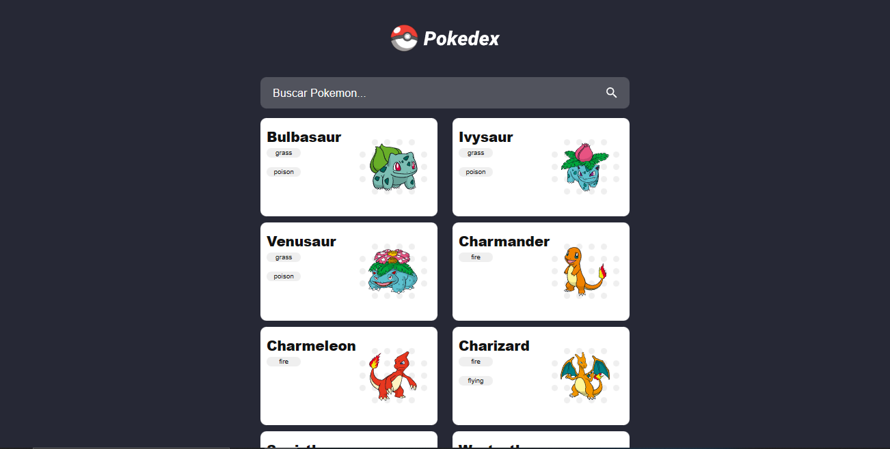
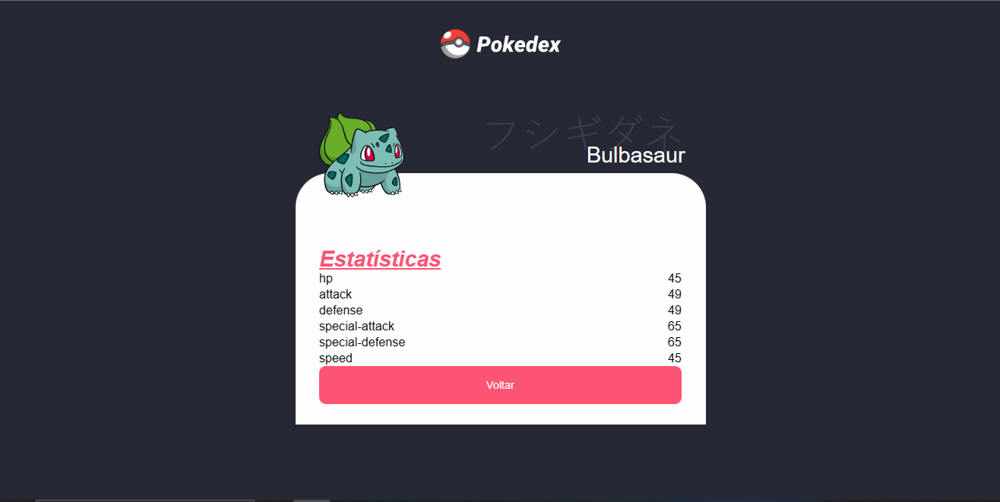

# pokedex-angular



Uma aplicação que simula uma pokedex onde é possivel procurar os pokemons pelo nome e acessar suas informações. link para testar: 


## Api utlizada https://pokeapi.co/

### 📋 Pré-requisitos
Para iniciar o projeto será necessário ter instalado em sua máquina o: [Git](https://git-scm.com), [Node.js](https://nodejs.org/en/). Além disto um editor, para trabalhar com o código como o VSCode.

## Executando
1. Clone o repositório para sua máquina

```
git clone https://github.com/kleber-a/computer-store.git
```
2. Instale o angular

```
npm install -g @angular/cli
```

3. Instale as dependências com `npm`

```
npm install
```

4. rode a aplicação 

```
ng s
```
